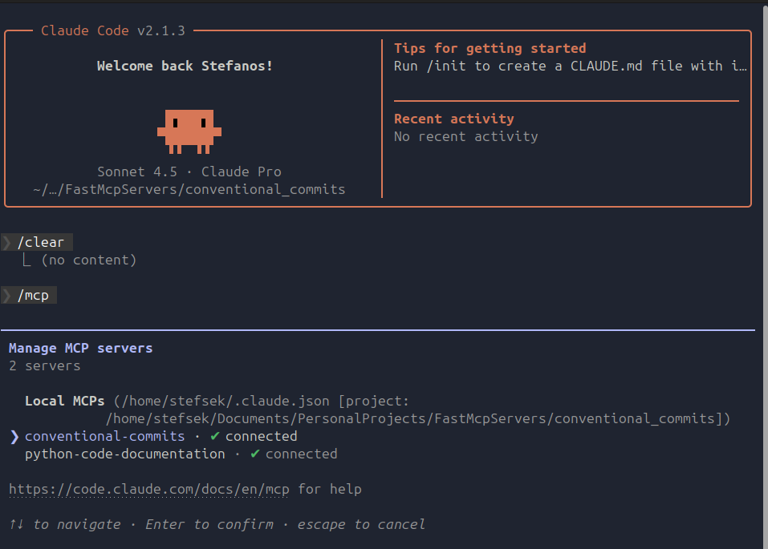
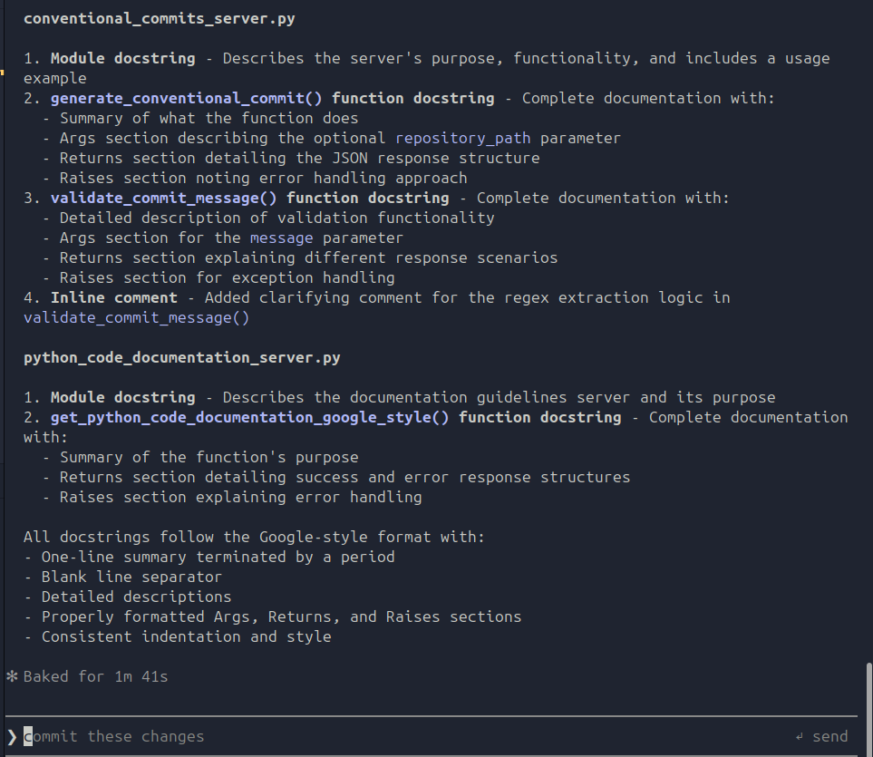
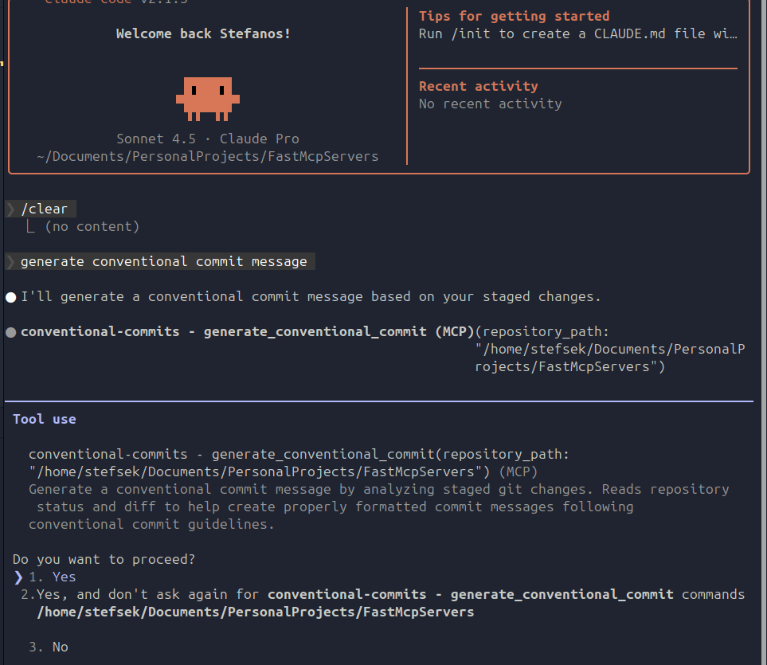
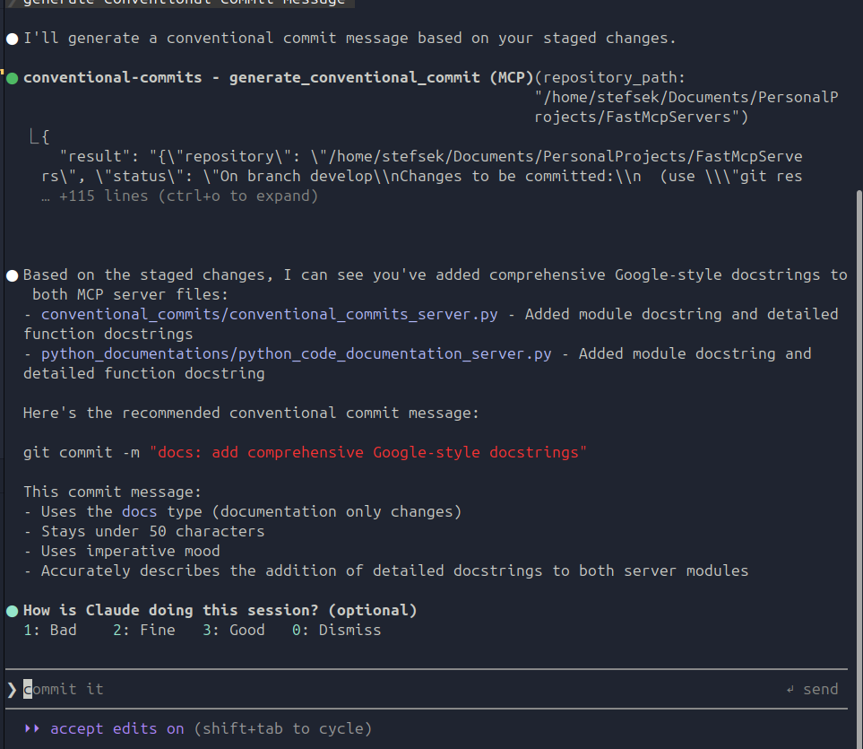

# FastMCP Servers

A collection of Model Context Protocol (MCP) servers built with FastMCP for enhancing development workflows.

## Servers

### 1. Conventional Commits Server

**Location:** `conventional_commits/`

**Purpose:** Automates the generation and validation of conventional commit messages according to the Conventional Commits specification.

**Features:**
- `generate_conventional_commit`: Analyzes staged git changes and provides guidelines for creating properly formatted commit messages
- `validate_commit_message`: Validates commit messages using commitlint to ensure they follow the conventional commit format

**Stack:**
- Python 3.13.5+
- FastMCP 2.14.5+
- Git
- Commitlint (for validation)

**How it works:**
1. Reads staged changes from the git repository
2. Loads conventional commit guidelines from local markdown files
3. Analyzes the diff and provides structured commit message recommendations
4. Validates messages against conventional commit standards using commitlint

**Tools Exposed:**
- `generate_conventional_commit(repository_path)` - Generate commit message from staged changes
- `validate_commit_message(message)` - Validate commit message format

---

### 2. Python Code Documentation Server

**Location:** `python_documentations/`

**Purpose:** Provides Google-style Python docstring and commenting guidelines to help developers write well-documented code.

**Features:**
- `get_python_code_documentation_google_style`: Retrieves comprehensive Python documentation standards including module, class, function, and inline comment conventions

**Stack:**
- Python 3.13.5+
- FastMCP 2.14.5+

**How it works:**
1. Serves pre-loaded Google-style Python documentation guidelines
2. Returns markdown-formatted documentation content
3. Provides structured error handling for file operations

**Tools Exposed:**
- `get_python_code_documentation_google_style()` - Get Google-style docstring guidelines

---

## Technology Stack

Both servers are built using:
- **FastMCP**: A Python framework for building Model Context Protocol servers
- **Python 3.13.5+**: Modern Python with type hints and enhanced error handling
- **MCP Protocol**: Standard protocol for AI model context integration
- **JSON**: Structured data exchange format

## Transport Protocol

These MCP servers currently use **`transport="stdio"`** (Standard Input/Output) for communication, but can easily be implemented with **`transport="http"`** depending on your deployment needs.

### stdio Transport (Current Implementation)

Uses stdin/stdout for communication. The server reads requests from standard input and writes responses to standard output.

**Use cases:**
- Local development and testing
- Desktop applications like Claude Desktop, Claude Code
- When the client launches the server as a subprocess
- Direct process-to-process communication
- Single client scenarios

**Example:**
```python
mcp = FastMCP("My Server")

if __name__ == "__main__":
    mcp.run(transport="stdio")
```

The client launches this via a command like `python server.py` and communicates through pipes.

### http Transport (Alternative Implementation)

Creates an HTTP/SSE (Server-Sent Events) server that listens on a network port.

**Use cases:**
- Remote server deployments
- Web-based clients
- When you need network-accessible endpoints
- Multiple clients connecting to the same server
- Production deployments behind load balancers

**Example:**
```python
mcp = FastMCP("My Server")

if __name__ == "__main__":
    mcp.run(transport="http", host="0.0.0.0", port=8000)
```

Clients connect via HTTP to `http://localhost:8000` (or wherever hosted).

### Key Differences

| Feature | stdio | http |
|---------|-------|------|
| **Client connections** | Single client | Multiple clients possible |
| **Network access** | Local process only | Network-accessible |
| **Setup complexity** | Simpler | Requires port configuration |
| **Overhead** | Minimal | HTTP layer overhead |
| **Use case** | Local development, desktop apps | Remote deployments, web services |

**Note:** To switch between transports, simply change the `transport` parameter in the `mcp.run()` call. All server functionality remains the same regardless of transport type.

## Project Structure

```
FastMcpServers/
├── conventional_commits/
│   ├── conventional_commits_server.py
│   ├── git_guides/
│   ├── pyproject.toml
│   └── uv.lock
├── python_documentations/
│   ├── python_code_documentation_server.py
│   ├── python_guides/
│   ├── pyproject.toml
│   └── uv.lock
├── examples/
│   ├── mcp_servers_claude.png
│   ├── conventional_commits_tool_call.png
│   ├── conventional_commits_tool_call_output.png
│   ├── python_google_docstrings_tool_call.png
│   └── python_google_docstrings_output.png
└── README.md
```

## Installation Guides for Coding Agents

### Supported Coding Agents

These MCP servers work with any MCP-compatible client. Here are the popular coding agents:

- **Claude Code**: https://code.claude.com/docs/en/mcp

- **Gemini CLI**: https://geminicli.com/docs/tools/mcp-server/

- **GitHub Copilot**: https://docs.github.com/en/copilot/how-tos/provide-context/use-mcp/extend-copilot-chat-with-mcp

---

## Generating MCP Configuration with FastMCP

**Suggested Method (Personal Preference):** Using FastMCP to generate MCP JSON configurations provides a consistent, reliable approach that works across all coding agents. This method ensures absolute paths, proper dependency management, and easy regeneration when configuration changes.

**Documentation:** https://gofastmcp.com/integrations/mcp-json-configuration

### Prerequisites

Install FastMCP and ensure `uv` is available:

```bash
pip install fastmcp
```

### Generate Configuration

Generate an MCP configuration for your server using the `--project` flag to specify the project directory:

```bash
# Generate configuration and save to file
fastmcp install mcp-json python_code_documentation_server.py \
  --project /absolute/path/to/project/python_documentations > mcp-config.json
```

**Output format:**
```json
{
  "python-code-documentation": {
    "command": "uv",
    "args": [
      "run",
      "--project",
      "/absolute/path/to/project/python_documentations",
      "--with",
      "fastmcp",
      "fastmcp",
      "run",
      "/absolute/path/to/project/python_documentations/python_code_documentation_server.py"
    ]
  }
}
```

### Advanced Generation Options

```bash
# With dependencies
fastmcp install mcp-json server.py --with pandas --with requests

# With environment variables
fastmcp install mcp-json server.py --env API_KEY=your-secret-key --env DEBUG=true

# From environment file
fastmcp install mcp-json server.py --env-file .env

# Specify Python version
fastmcp install mcp-json server.py --python 3.13

# Select specific server object
fastmcp install mcp-json server.py:my_custom_server
```

### Using fastmcp.json for Reusable Configuration

Create a `fastmcp.json` file in your server directory:

```json
{
  "$schema": "https://gofastmcp.com/public/schemas/fastmcp.json/v1.json",
  "source": {
    "path": "conventional_commits_server.py",
    "entrypoint": "mcp"
  },
  "environment": {
    "dependencies": ["fastmcp", "gitpython"]
  }
}
```

Then generate:
```bash
fastmcp install mcp-json fastmcp.json
```

---

## Attaching Configuration to Coding Agents

After generating the MCP JSON configuration, add it to your coding agent's configuration file:


## Demo Examples

### MCP Server Configuration in Claude Code

Once configured, both servers appear in Claude Code's MCP interface, making their tools available for use:



### Example 1: Adding Google-Style Python Docstrings

You can ask Claude to add comprehensive Google-style docstrings to your Python code.

**Prompt:** `use get_python_code_documentation_google_style to generate docstrings and comments google style for @conventional_commits/conventional_commits_server.py and @python_documentations/python_code_documentation_server.py`

The tool fetches the guidelines:


**Result:** Claude uses the guidelines to add comprehensive docstrings to your code:



The added documentation includes:
- Module docstrings with purpose and usage examples
- Function docstrings with detailed descriptions
- Args, Returns, and Raises sections
- Inline comments for complex logic
- All following Google-style conventions

### Example 2: Generating Conventional Commit Messages

When you have staged changes in your git repository, you can ask Claude to generate a properly formatted commit message.

**Prompt:** `generate conventional commit message`

The tool is called automatically:



**Result:** Claude analyzes your staged changes and generates a conventional commit message following the guidelines:



The output includes:
- Repository path and git status
- Analysis of staged changes
- Generated commit message following conventional format
- Ready-to-use `git commit -m "message"` command

---

## Future Implementations

### Token Counting System

Implement token counting mechanism before feeding content to LLMs for better token control and cost management.

**Planned improvements:**
- Pre-process and count tokens in input data (diffs, guidelines, documentation files)
- Set configurable token limits per request
- Implement smart truncation strategies when content exceeds limits
- Add token usage metrics and logging
- Optimize content delivery to stay within model context windows
- Provide warnings when approaching token limits

This will enable more efficient LLM usage and prevent unexpected costs from large file processing.
